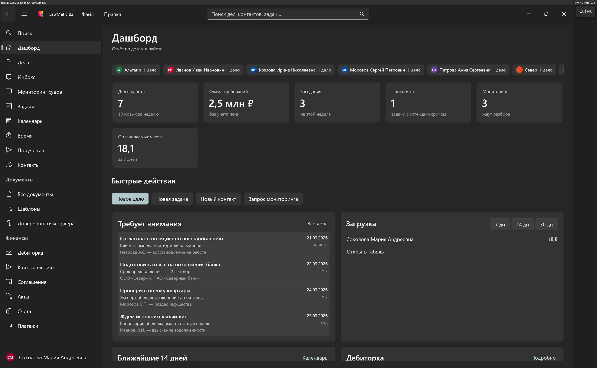
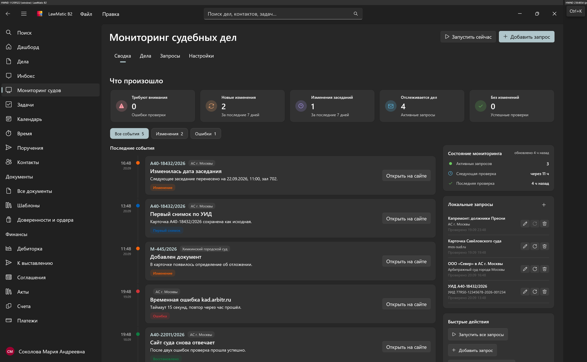
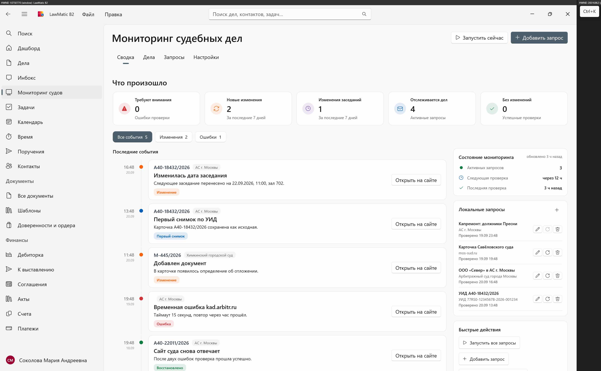

# LawMatic B2 для Windows

Настольная программа учёта юридической работы: дела, суды, задачи, документы и финансы — **на вашем компьютере**. Без обязательной регистрации в облаке и без отправки базы «в интернет по умолчанию».

Подойдёт адвокату, юристу компании, судебному представителю и тем, кто ведёт свои дела сам и хочет держать материалы под рукой, а не в чужом сервисе.

---

## Исходный код — платная функция и NDA

Мы готовы **открыть все исходные коды** Windows-версии тем, кто хочет сам убедиться в безопасности программы.

Это **платная функция**: доступ к исходникам получают пользователи, которые

1. оформляют подписку на LawMatic B2 и
2. подписывают соглашение о неразглашении (NDA).

После этого вы (или ваш специалист по безопасности) можете:

- прочитать весь код;
- собрать программу самостоятельно;
- проверить, что данные не уходят «мимо вас»;
- убедиться, что в продукте нет скрытых закладок.

Так пользователь полностью контролирует то, чем пользуется. Условия и доступ: **info@lawlabs.ru**.

Исходники соседних клиентов (macOS, iOS, Android) обсуждаются отдельно; описание macOS — в [LawMatic B2 для macOS](https://github.com/lawlabs/LawMatic-B2-macOS).

---

## Как выглядит программа

Тёмная и светлая темы, данные остаются в локальной базе на компьютере.

**Дашборд** — дела в работе, заседания, просрочки, очередь внимания и загрузка по часам:

**Мониторинг судов** — программа сама проверяет карточки дел на сайтах судов и показывает, что изменилось (дата заседания, новый документ, ошибка сайта). Запросы идут с вашего компьютера, снимки сохраняются у вас:

Та же страница в светлой теме:

---

## Зачем это юристу

Обычные «облачные» CRM удобны, пока вы готовы отдать чужому серверу переписку, гонорары и позиции по делам. LawMatic B2 устроен иначе:

- **Сначала локально.** База живёт на диске вашего ПК. Работать можно без аккаунта и без сети.
- **Потом — если нужно — синхронизация.** Можно подключить общий сервер Legalic или обмениваться файлом базы. Чувствительное можно оставить только у себя.
- **Один файл с Mac.** База совместима с версией для macOS: открыли `.dat` с Mac на Windows и наоборот.

### Что можно вести в программе

| Раздел | Для чего |
| --- | --- |
| **Дела и участники** | Карточка спора, суд, УИД, стороны, судья, представители |
| **Инбокс заседаний** | Прошедшие заседания, по которым ещё не внесли исход |
| **Мониторинг судов** | Следить за карточками на сайтах судов без ежедневного ручного обхода |
| **Задачи и календарь** | Сроки, заседания, неделя / день / месяц |
| **Учёт времени** | Оплачиваемые часы по делам |
| **Поручения** | Передача задач коллегам с принятием и ответом |
| **Документы и шаблоны** | Иски, отзывы, претензии; сборка из шаблона |
| **Доверенности и ордера** | Срок действия и напоминания о переоформлении |
| **Финансы** | Соглашения, начисления, счета, акты, платежи, дебиторка |

Поиск по базе (в том числе с клавиатуры) находит дело, контакт, задачу и запрос мониторинга.

---

## Безопасность без лозунгов

- Данные по умолчанию **не уезжают на чужой хостинг**.
- Мониторинг судов обращается только к тем сайтам, которые вы сами указали в запросе.
- Синхронизация с Legalic — отдельный шаг: её можно не включать.
- Кому важно доказать это коллегам или службе ИБ — доступен аудит исходного кода (см. выше).

---

## Для кого

- Адвокатские образования и небольшие бюро, которым нужна «своя» база, а не общий облачный кабинет.
- Юристы компаний, которые ведут судебный портфель на рабочем ПК.
- Представители граждан и сами заявители, которым удобнее держать дело, сроки и документы в одной программе, а не в папках и таблицах.

Нужна Windows 10 или новее. Установка и лицензия — по запросу на **info@lawlabs.ru**.
